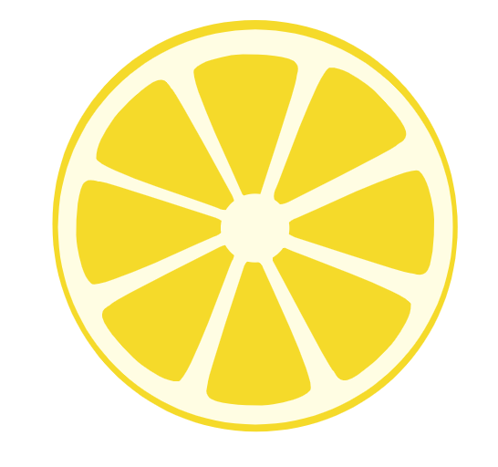
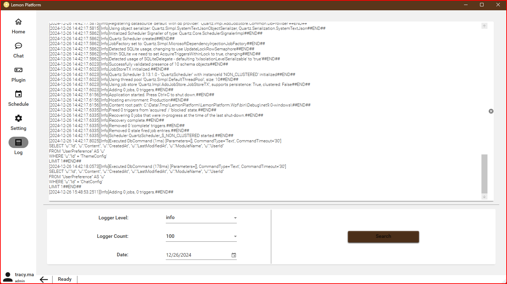

# Lemon Platform
<div align="center">



</div>

## :rocket:About
***Lemon Platform*** is a WPF-based plugin development framework that facilitates the integration of custom features. The framework currently supports various functionalities, such as visualization of **sorting algorithms**, visualization of **data structures**, and games like ***Minesweeper*** and ***A Puzzle A Day***.
## :sparkles:Features
### Home Page
Welcome Page and we can get some guide in this page, here is the screen shot:


### Chat Page
All the chat items, you can add new chat and remove any chat in this page. Chat history will save in local sqlite data base, and recover it in next open.


### Plugin Page
In this page you can see all the loaded plugin, the source code in ***modules*** folder, we can add custom module in this framework.


### Schedule Page
We can add schedule in modules, and manage it in this page. 

### Setting Page
We can setting theme in this page.


### Log Page
All the log to see in this page. the origin log file in ***logs*** folder.


## :star:Modules
- **Data Structures**
	- [x] [Skip List](documents/data-structure/skip-list.md)
	- [x] [Red Black Tree](documents/data-structure/red-black-tree.md)
	- [x] [AVL Tree](documents/data-structure/avl-tree.md)
	- [ ] Balance Tree
	- [ ] Max Heap
	
- **Algorithm**
	- [ ] Bubble Sort
	- [ ] Bubble Sort(v2)
	- [x] [Selection Sort](documents/aggorithm/selection-sort.md)
	- [ ] Shell Sort
	- [ ] Insert Sort(v1)
	- [ ] Insert Sort(v2)
	- [ ] Heap Sort
	- [ ] Merge Sort(v1)
	- [ ] Merge Sort(v2)
	- [ ] Quick Sort(v1)
	- [ ] Quick Sort(v2)
	- [ ] Quick Sort(v3)
	- [ ] Quick Sort(v4)
	
- **Graph**
	- [ ] Graph

- **Game**
	- [x] [A Puzzle A Day](documents/game/a-puzzle-a-day.md)
	- [x] [Mine Sweeper](documents/game/mine-sweeper.md)

- **Visualization**
	- [ ] Snow Flake


## :memo:Installation
### :zap:.Net Developer
1. The project is based on .NET 9. If you need to run and compile this project, please install [.NET 9 SDK](https://dotnet.microsoft.com/en-us/download/dotnet/9.0) first.
2. Please use Visual Studio 2022 to open this solution.
3. Clone the project to your local machine:

    ```bash
    git clone https://github.com/tracyma-05/LemonPlatform.git

    cd LemonPlatform

    dotnet build
    ```
## :ambulance:License
This project is licensed under the MIT License - see the [LICENSE file](./LICENSE) for more details.

## :racehorse:Contact
For further questions or assistance, please contact us through the following:
- Email: [zhongbin_ma@outlook.com](mailto:zhongbin_ma@outlook.com)

## :bug:Issues
- Submitting an issue: [Lemon Platform Issues](https://github.com/tracyma-05/LemonPlatform/issues)