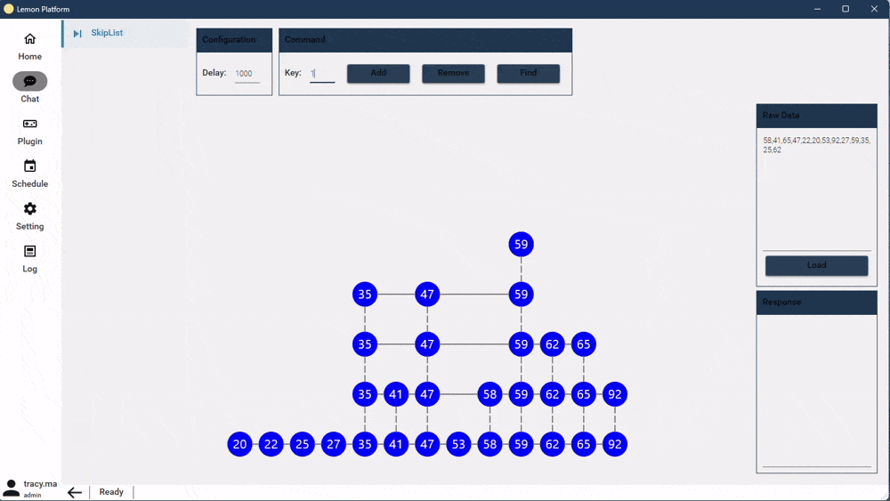
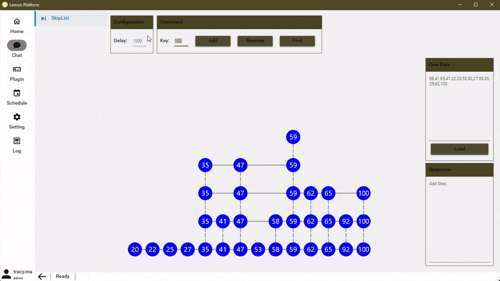
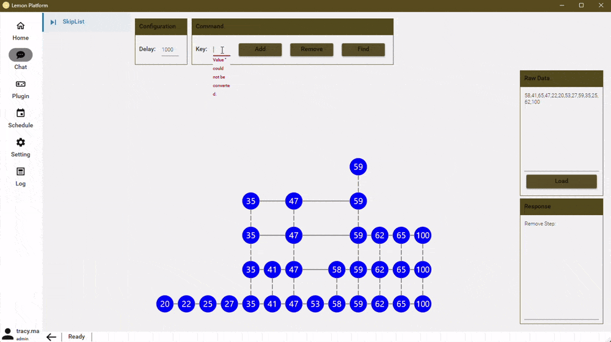

# Skip List

## About

跳表是一种神奇的数据结构，因为几乎所有版本的大学本科教材上都没有跳表这种数据结构，而且神书《算法导论》、《算法第四版》这两本书中也没有介绍跳表。但是跳表插入、删除、查找元素的时间复杂度跟红黑树都是一样量级的，时间复杂度都是**O(logn)**，而且跳表有一个特性是红黑树无法匹敌的(就是**按照区间来查找数据**，红黑树的效率没有跳表高，跳表可以做到 **O(logn)** 的时间复杂度定位区间的起点，然后在原始链表中顺序往后遍历就可以了，非常高效)。所以在工业中，跳表也会经常被用到，比如Redis中的有序集合(***ZSet***)。

## Position
- **Menu** : Plugin -> DataStructures -> SkipList

## Operation
- **Load** : 在Raw Data窗口输入一组整数数据，使用逗号(,)进行分割。单击Load即可把这组数据使用跳表的数据结构可视化的展示出来。

- **Add** : 在Key中数据想要添加的数字后，单击Add按钮，即可在Skip List中加入该节点，同时会使用可视化的形式展示出具体的路径。

- **Remove** : 在Key中数据想要添加的数字后，单击Remove按钮，即可在Skip List中删除该节点，同时会使用可视化的形式展示出具体的路径。

- **Find** : 在Key中数据想要添加的数字后，单击Find按钮，即可在Skip List中找到该节点，同时会使用可视化的形式展示出具体的路径。

